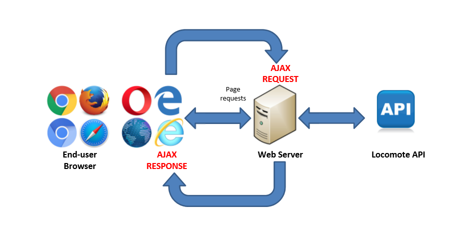

# Locomote code task

----------

## Description

This project is a coding assignment, in which the task is to build an airline flight-search application.
The app consists of two components:

1. A **Back-end server,** which accepts and responds to queries from the user's browser
2. A **Front-end application,** which has a user-friendly interface, and allows the user to search for flights, based on a specific origin, destination, and date. 

For the purposes of this exercise, the front-end application is not permitted to use web frameworks such as React or Angular, but it may use utility libraries such as lodash, jQuery, and moment.js

Note: the original brief for the project can be found [here](http://node.locomote.com/code-task/ "here")

The overall achitecture looks something like this:

 

## Target environments

a) Front End

The **front-end** has been extensively tested on a number of browsers and platforms. 
A summary of the some of the results of testing on various browsers and OSes can be found in the following pdf:

[Browser-Notes-Observations.pdf](./flight-search/Browser-Notes-Observations.pdf "Browser Notes and Observations")

Am assortment of screenshots from these tests can also be found here: [./images/screenshots](flight-search/images/screenshots)

*(One of the biggest challenges with this project was dealing with the html5 date and datalist inputs which, at the time of writing, are still missing from various modern browsers. The solution was to polyfill using jQueryUI)*

b) Back-End

The **server components** (ie the back-end server and a web server to serve the user's front-end) are expected to run on any platform capable of running **Node** and **npm** , including mac, linux, or windows, with the the latter two probably being more commonplace as server platforms. 

The back-end has been tested on **Kubuntu 16.04,** **Windows 10**, and **Macintosh OSX,** all intel x64 versions.

Node Versions **v4.2.6,** **v4.4.5,** **v4.4.7** have been tested thus far, and further testing on other Node versions (both older and newer) is underway. 

However, it is not anticipated that the version of Node will be particularly critical for this project (with ES6 arrow functions and Promises being the only remotely "exotic" language features used)

Nevertheless, at the time of writing, it is recommended to stay on the Node version-4 track, as it has LTS status until April 2018.

## Prerequisites

* **Node.js** v4 or higher needs to be installed on the target platform
* **npm** needs to be installed on the target platform
Please visit [https://nodejs.org/](https://nodejs.org) for details on how to install Node on particular platforms
* **mocha** (used for testing) needs to be installed globally
* npm package **http-server** (used for serving the front-end) needs to be installed globally

these packages usually need to be installed with admin permission. For example, on ubuntu:

    sudo apt-get install nodejs
    sudo apt-get install npm
    sudo npm install mocha -g
	sudo npm install http-server -g 
    
(UBUNTU ONLY) node is called 'nodejs' on ubuntu - so, create a symlink:

    sudo ln -s /usr/bin/nodejs /usr/bin/node

## Starting the server

Once **Node, npm, mocha,** and **http-server** have been installed,

cd to the root directory of the project.

ensure that **start.sh** and **flight-server/start.sh** have execute permissions. For example:

	chmod +x start.sh
  chmod +x flight-server/start.sh

then just run start.sh from the root of this project eg:
    
    ./start.sh

*Note to Windows Users: to run bash scripts, the use of [Git Bash](https://git-for-windows.github.io/ "Git Bash") is recommended.* 

Note: running **start.sh** from the root of the project actually launches TWO servers ! 

1. the **back-end server** written in Node/Express running on **port 9000**
2. the **front-end server** running on port **3000**

... these correspond to the two components of this project. In a production environment, these two services could (and maybe should) be run on entirely different machines / VMs.

The end-user connects their browser to the front-end server on port 3000

The startup process for the back-end server incorporates a suite of tests before the service starts. All of the tests are expected to pass. Failure to pass all tests indicates a problem.

Additionally, the test suite can be run at any time from the **flight-server** directory, by running the command:

**npm test**

However, it will not work if there is an instance of the back-end server already running, as a conflict will arise from both instances trying to bind to port 9000

## testing the app in a browser

Once both the front-end server and back-end server are running,
enter the address of the front-end server in your browser:

**http://localhost:3000**

and do a basic flight search:

the cities shoould auto-complete when you type 2-3 characters ...

From: syd

To: new (york)

Date: (some date in the future)

## Application Design and Behaviour

The flight search needs to be intuitive, fast and easy to use. It should only require 3 input fields to be completed by the user in order to to give back a meaningful search result.

The input consists of an origin (aka 'from'), destination (aka 'to') and date field.

Once the user starts typing into either the 'from' or 'to' fields, the app will look for matches from the back-end server in order to provide suitable auto-complete options as drop-downs
 
The date needs to be unambiguous, and therefore a date-picker component is employed to ensure that the user can select valid dates with confidence and comfort.

Upon hitting the search button, a flight search typically takes around 6-7 seconds, and thus some reassurance needs to be provided to the user that the search is underway, and that results will soon be available. In order to achieve this, a "glowing button" effect is implemented on the search button, to indicate that it is active.

(Additional animations may also contribute to providing good feedback to the user, such as a flying jet or similar - this is something to be considered as a future additon to the interface.)

The search results are subsequently displayed in a table, and the user has the opportunity to sort the results in various ways for a period of 5 minutes, after which the results are considered to have expired, triggering another search query to be sent to the server using the current search criteria and sort options.

*above: flight-search running on Firefox v48 on Macintosh OSX 10.7*

Finally, the user can select a flight by clicking on the relevant "Select" button, which will take them to a confirmation screen. 

(Since Locomote provides a workflow for their corporate customers, the flight would be sent off to the user's manager for approval at this point, but the implementation of that behaviour is beyond the scope of this project) 

The end-user should expect to be able to use the app on a variety of different devices and browsers, so the interface needs to be responsive enough to provide a usable experience on any screen size.

(currently, the formatting of results for small screens is readable, but still needs tuning ... )

## Technologies used

* Back-end server: **node.js** and **Express** (mostly ES5 syntax, with the only notable exceptions being arrow functions and Promises)
* Back-end testing: **mocha** (testing framework) and **chai** (adds 'expect' module, among other things)
* Back-end logging: **morgan** - provides basic logging of incoming requests and their eventual results (logging is certainly one area that could be expanded in this project - separate logs for errors vs access, and log rotations could ve implemented)
* Back-end: **cors** - cross origin resource sharing facilitates communication between the browser and the back-end server when the front-end server is on a different domain to the back-end server. (Note: In a production environment, the Access-Control-allow-Origin policy should be tightened to specify the expected origin site) 
* Front-end: **moment.js** - utility library for handling dates and times
* Front-end: **Bootstrap 3** - used to provide form field validation feedback (red/green) and responsive design
* Front-end: **jQuery** - used for selecting various DOM elements and a few event handlers
* Front-end: **jQueryUI** (custom build with only datepicker and autocomplete) - used to polyfill html5 date and datalist on broswers that don't have them
  
## Additional information on the project components

More detailed information on the individual components (back-end server and front-end server) can be found in the README.md files of their respective subfolders:

flight-search:
[./flight-search/README.md](./flight-search/README.md)

flight-server:
[./flight-server/README.md](./flight-server/README.md)

